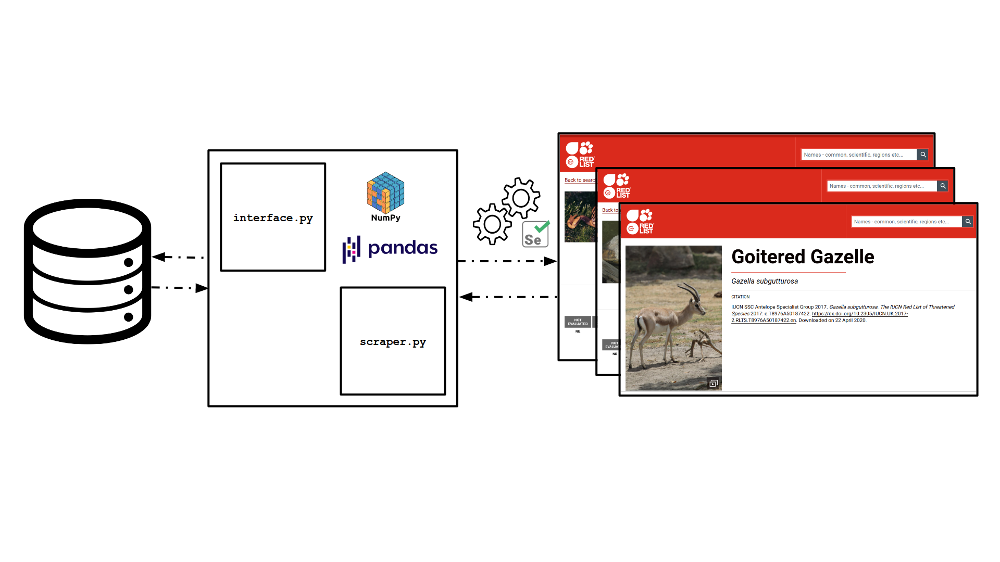

# Red

:warning: Code is buggy :warning:

## 1.0 Introduction:

+ The aim of the project is to analyze corelations between the threat status of a particular species tracked on the [IUCN Red List](https://www.iucnredlist.org/ "IUCN Red List"), and their threats and stresses.

+ This repository is dedicated to the scrapping of the necessary datafields from the [IUCN Red List](https://www.iucnredlist.org/ "IUCN Red List") to prove such corelations.

+ This project is a collaboration with [Uttara Mendiratta](https://www.researchgate.net/profile/Uttara_Mendiratta "Uttara") and [Anand M Ossuri](https://www.ncf-india.org/author/675623/anand-osuri-2 "Anand") from the [Nature Conservation Foundation, India](http://ncf-india.org/ "NCF-India").

## 2.0 Implementation

1. The [```birds.csv```](https://github.com/SarthakJShetty/Red/tree/master/data/birds.csv) and [```mammals.csv```]((https://github.com/SarthakJShetty/Red/tree/master/data/mammals.csv)) contain the species for which the data has to be scrapped.

2. The permissions of the [```start.sh```](https://github.com/SarthakJShetty/Red/blob/master/start.sh) have to be changed before the first run of the code.

        user@computer:~/Red chmod +X start.sh

3. The pipeline is triggered using the [```start.sh```](https://github.com/SarthakJShetty/Red/blob/master/start.sh) script, that in-turn triggers the [```scraper.py```](https://github.com/SarthakJShetty/Red/tree/master/scraper.py) code.

        user@computer:~/Red ./start.sh

4. The scrapped data is stored to the disc in the form of a ```X_WORKING.csv``` file, a copy of the original ```.csv```, ensuring the originals are not tampered with.

## 3.0 Model Overview:

+ The model is made of two components: 1. [```interface.py```](https://github.com/SarthakJShetty/Red/tree/master/interface.py) and 2. [```scraper.py```](https://github.com/SarthakJShetty/Red/tree/master/scraper.py).


<i>Figure 2.1 Model to scrape data from IUCN Red List</i>

### 3.1 Interface

1. Disk write/read operations are handled by the [```interface.py```](https://github.com/SarthakJShetty/Red/tree/master/interface.py) code.

2. The [```pandas```](https://pandas.pydata.org/) dataframe is saved to the disc by the [```interface.py```](https://github.com/SarthakJShetty/Red/tree/master/interface.py) code after each run.

### 3.2 Scraper

1. The [```scraper.py```](https://github.com/SarthakJShetty/Red/tree/master/scraper.py) interacts with the webpage using the [Selenium](https://www.selenium.dev/) framework for performance testing. 

2. The ```HTML``` ```tags``` contained in the ```page_source``` gathered by the [```Selenium```](https://www.selenium.dev/) middleware code is made searchable using [```BeautifulSoup```](https://www.crummy.com/software/BeautifulSoup/)

3. The [```scraper.py```](https://github.com/SarthakJShetty/Red/tree/master/scraper.py) pipeline collects the prescribed ```HTML``` tags from the website queried and updates a [```pandas```](https://pandas.pydata.org/) dataframe with the information.

4. The ```speciesCounter()``` of the [```scraper.py```](https://github.com/SarthakJShetty/Red/tree/master/scraper.py) script returns the ```sno``` of the last species that's missing the ```stable```, ```unknown``` or ```decline``` population trend tags, which all scrapped species must have.

## 4.0 Known Issues:

1. While writing elements to the [```pandas```](https://pandas.pydata.org/) dataframe an element maybe right-shifting a column(s). This error may lead to a [```pandas```](https://pandas.pydata.org/) memory warning, considreing entities of multiple datatypes occupy the same column.

2. Some species are not indexed by the [IUCN Red List](https://www.iucnredlist.org/ "IUCN Red List"). This may cause the [```start.sh```](https://github.com/SarthakJShetty/Red/blob/master/start.sh) script to loop while trying to collect the species ```URL``` from the searchpage.